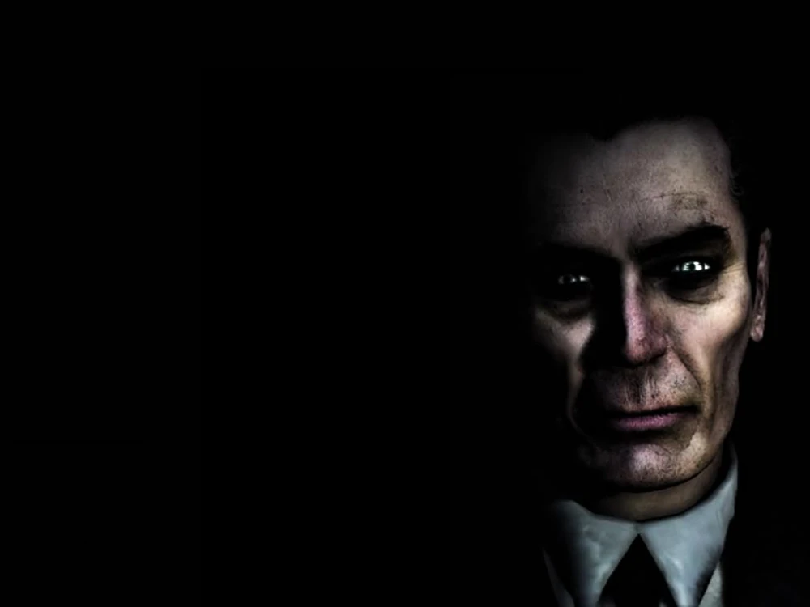
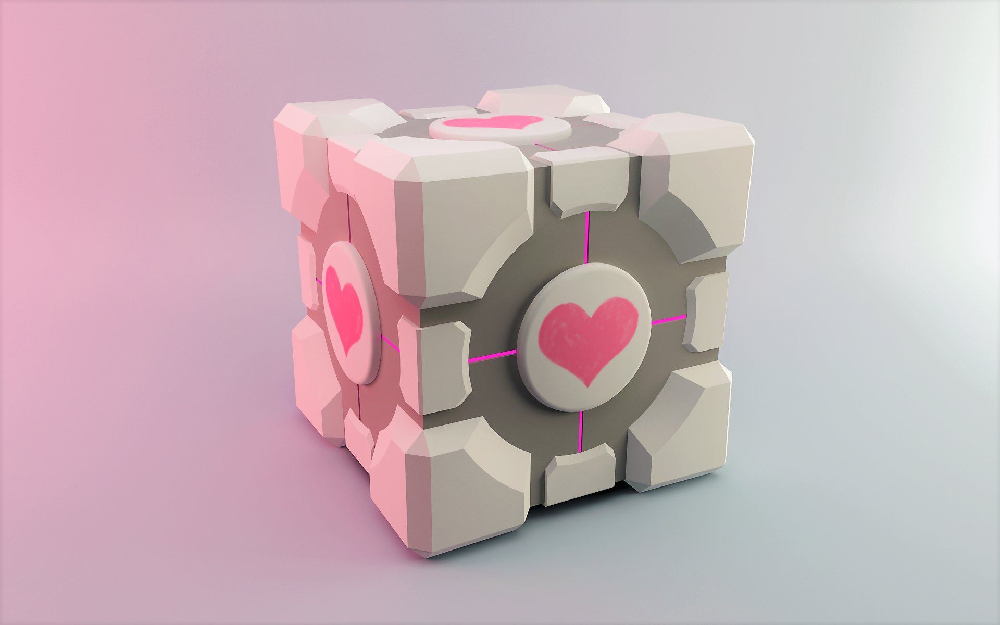
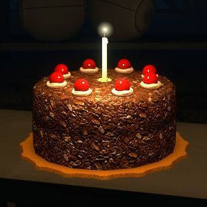

subject_rush01

## Introduction

* * *



* * *

### *-Point insertion-*

**G-man** \- "*Rise and shine Mr. Freeman, rise and shine. Not that I wish to imply that you have been sleeping on the job. No one is more deserving of a rest than you.*

*And all the effort in the world would have gone to waste until.... Well lets just say your hour has come again. The right man at the wrong place can make all the difference in the world. So wake up Mr. Freeman, wake up and smell the ashes.*

> *(The g-man slowly fades away into the background and his image is replaced with the viewpoint of Gordon Freeman on a train pulling into a station)*

### *-Dark Energy-*

**Alyx** \- *Oh my god, the portal is opening!*
**Dr. Breen** \- *I hope you have said your farewells.*

> *(Gordon uses the gravity gun to shoot the energy orbes into the portal)*

**Dr. Breen** \- *Go back Freeman, you have no idea what you are doing!*

> *(Gordon blows up the portal)*

**Dr. Breen** \- *NO! You need me!*
**Alyx** \- *Yes!*

> *(The shield covering the control room shuts off and Alyx steps out)*

**Alyx** \- *Yeah! You did it! Come on Gordon, we have got to get out of here, maybe we still have...*

> *(The portal collapses and explodes, time begins to slow down and a Mysterious man in a black suit slowly appears...)*

**G-man** \- *Time? Dr. Freeman? Is it really that time again? It seems as if you only just arrived. You have done a great deal in a small timespan. You have done so well, in fact that I have received some interesting offers for your services.* *Ordinarily I would not contemplate them, but these are extraordinary times.*

*Rather than offer you the illusion of free choice, I will take the liberty to choosing for you. If and when your time comes round again.*

> *(The background begins to fade to black, a greenish light appears)*

**G-man** \- *I do apologize for what must seem to you an arbitrary imposition, Dr. Freeman, I trust it will all make sense in the course of.. well.. I am really not at liberty to say.*

> *(The background turns to a black tunnel with white strands of light flying by)*

**G-man** \- *In the meantime, this is where I get off.*

> *(A door slides open in the air, the Mysterious man steps in and the door shuts behind him ...
> ... and the credits roll)*

***[Half Life 2 - Episode One](https://gamefaqs.gamespot.com/pc/914642-half-life-2/faqs/38075 "hlf2.exe")***

* * *

* * *

* * *

* * *

* * *

* * *

* * *

* * *

* * *

* * *

* * *

* * *

* * *

* * *

* * *

* * *

* * *

* * *

* * *

* * *

* * *

* * *

* * *

* * *

* * *

* * *

***
***

### Petites précisions et règles de bon sens:

---

*La moulinette a un **timeout** sur le temps de clonage, ne vous amusez pas à mettre des fichiers trop lourds dedans.*

*Il est **interdit de copier** le code d'un autre groupe, même avec l'accord dudit copié. On prête ses idées, pas son code.*

***On regardera votre code** : cela permettra d'éviter la triche mais aussi de documenter les techniques et d'apprendre des choses, pour ensuite les partager.*

***Pas de panique*** : _Rien de bien sorcier n'est demandé. Vous avez tous utilisé les principes nécessaires à la bonne réalisation du Rush._

***Un Dockerfile*** _sera présent dans le dossier de rendu. Il vous sert à tester la compilation de votre code._

*Si vous voulez des conseils en **Makefile**, pensez à demander aux tuteurs, ou sinon (en cas d'extrême pénurie de tuteurs) à* `guhernan` . *Rappelez-vous de ces addages :*

> *Un Makefile dégueulasse, c'est vraiment pas la classe.*

> *Si tu fais un code pas folichon, on te prendra pour un couillon.*

---

*Pensez au fichier `auteurs` !*

* * *

* * *

* * *

* * *

* * *

* * *

* * *

* * *

* * *

* * *

* * *

* * *

* * *

* * *

* * *

* * *

* * *

* * *

* * *

* * *

* * *

* * *

*S'il vous plaît, respectez notre travail.*

* * *

* * *

* * *

* * *

* * *

* * *

* * *

* * *

* * *

* * *

* * *

* * *

* * *

* * *

* * *

* * *

* * *

* * *

* * *

* * *

* * *

* * *

* * *

* * *

* * *

* * *

* * *

* * *

* * *

* * *

* * *

* * *

* * *


# **O** *(nly)* **F** *(ucking)* **C** *(ube)*

Vous êtes désormais perdus dans un monde inconnu où tout a prit une forme carrée. Le soleil, les nuages, du sommet des arbres à la terre compacte, votre tête, votre tronc, vos mains... ***tout est maintenant carré. Et tout doit être pensé comme tel.***

En parlant du soleil, celui-ci avance à une vitesse inquiétante. Peu-à-peu, les secondes deviennent des minutes et les minutes des heures, mais aucune trace de civilisation à l'horizon.

Vous avez faim, soif, et le temps presse pour trouver un abri pour la nuit...

Heureusement, vous avez pu sauver du naufrage juste assez de matériel pour bivouaquer en toute tranquillité. Il vous suffit maintenant de trouver un bon lieu pour dormir.

Ma foi...
Lequel choisir...

* * *

* * *

## Des instructions interminables

* * *

### *Au moment de s'installer pour passer la nuit, la tension monte au sein du groupe :*

**Jean Pormanove** :  *Il faut définitivement choisir l'endroit où l'on aura le plus grand espace. Dormir le nez sur le trou de chiottes de Bernard, c'est comme signer son arrêt de mort.*

**Abil Bille** :  *Arrêtez un peu de dire des bêtises. Pensez plutôt à nous trouver un espace carré où l'on pourra éviter d'être séparés ; nous n'avons que peu de torches. Je vais voir si on peut en bricoler.*

> *Abil commença à creuser le sol avec les mains et à briser le bois avec ses poings.*

**Mme Puff Dadie** :  *Mon mari m'a toujours dis de grimper sur une table quand je vois une souris, mais s'il s'agit d'araignées poilues comme M. Bernard...*

> *Bernard planta sa pelle d'un coup sec et se redressa.*

**Bernard Dédé** :  *Ça suffit de piailler dans mon dos ?! Continuez à me casser les c*\*\*\*\*\*\* et c'est ma p***** de p**** qui va se retrouver dans votre g**** !*

> *Un cri se fit entendre au loin, suivi d'une explosion.*

**J-B Lesc'O'tsh** : *Laisse couler Dédé, occupes-toi plutôt de creuser, ce sont nos vies qui sont en danger...*

**Bernard Dédé** : *Mais creuser où et comment ?? Arrêtez de vous f*\*\*\*\*\* de ma p***** de g***** ! On sait même pas où ce f*** de p*-*

> *Pomanove le coupa*

**Jean Pormanove** : *Tiens, prends les infos qu'Abil a pu choper en chemin. C'est toujours ça. Il m'avait dit que ça nous permettait de déduire la superficie et l'organisation de l'île.*

**Bernard Dédé** :  *Habile ...*

**Jean Pormanove** :  *BILLE ! Viens par ici !*

**Abil Bille** :  *Qui ça, moi ?*

**Jean Pormanove** :  *Non c'est au squelette derrière toi que je parle !*

> *Le visage blème, Abil s'enfuit en courant... Pas très habile de la part de Jean.*

> *Glados Bakes, à peine sortie de sa sieste, lança interloquée :*

**Glados Bakes** :  *Il a quoi, Bille ?*

**Jean Pormanove** :  *Il croit encore aux histoires de fantômes.*

**Mme Puff Dadie** : *Il sait au moins reconnaitre une mauvaise blague.*

**J-B Lesc'O Tish** :  *Après toutes ces années de voyage, ainsi s'en est allé tout son courage...*

**Bernard Dédé** :  *Tiens Glados, tu sais peut-être lire ?*

**Glados Bakes** :  *Je veux bien si j'ai le droit d'avoir une part de cake en plus.*

**Bernard Dédé** : *Du gâteau... Ah oui... oui... oui bien sûr !*

> *Un doux vent souffla aux oreilles de nos aventuriers, comme un chuchotement... (**The cake is a lie**)*

> *Glados reprit :*

*-  Je suis une experte en casse tête. Le plan a dû être construit selon un repère orthogonale avec un axe des abscisses et des ordonnées, car c'est écrit : "Soit O, I, J trois points distincts non alignés- "*

> *Dédé l'interrompit*

**Bernard Dédé** :  *Coupes court Glados, on a pas toute la journée !*

**Mme Puff Dadie** :  *... Et même pas une partie de la nuit !*

**Glados Bakes** :  *TRES BIEN, TRES BIEN, alors. Là il devrait y avoir les abscisses, là les ordonnées, et toutes deux ont pour référentiel '0' , soit le coin en haut à gauche de la carte.*

**J-B Lesc'O'tsh** :  *Pourquoi il y a différents symboles sur cette même carte ? C'est à rien n'y comprendre...*

**Jean Pormanove** :  *HEY BILLE, REVIENS ! J'DECONNAIS ! ILS SORTENT QUE LA NUIT !*

**Mme Puff Dadie** :  *Il ne reviendra pas.*

**Jean Pormanove** :  *Vous, occupez-vous de vos oignons. Glados, continue avant que j'la fasse fuir...*

> *Glados s'éclaircit la voix.*

**Glados Bakes** : *Je reprends. Si ça c'est un repère, alors les chiffres doivent représenter divers espaces sur l'île.*

> *C'est alors que Bernard s'écrie :*

**Bernard Dédé** : *AH ! Mais v'la tous ces '1' sur le sol, c'est d'la verdure comme chez nous !*

**Mme Puff Dadie** : *Bernard, je te présente l'Herbe. L'Herbe, Bernard.*

**Bernard Dédé** : *Tiens moi ma pelle Porma', j'vais lui régler son compte à l'ancienne...*

> *Bernard remonte ses manches, prêt à en découdre avec la vieille dame au chandail.*

**Gladis Lanis** : *DU CALME ICI !*

> *Le silence tomba.*

**Glados Bakes** : *Voyez-donc ces symboles comme vous l'entendez. Prenez la [table ascii](https://man7.org/linux/man-pages/man7/ascii.7.html) si ça vous chante. Moi ce que je vois, c'est qu'ils permettent d'identifier l'espace. Là c'est la plage, là c'est le terrain en terre, là c'est la zone rocailleuse par exemple.*

**Mme Puff Dadie** : *... Et les chiffres sont là pour dire quel terrain est plus haut que l'autre ! Et bien c'était pas si compliqué !*

**Jean Pormanove** : *Mais le plus important reste l'espace viable. En avoir suffisamment pour être un peu tranquille. D'ailleurs je vous ai dégoté de quoi passer la nuit au chaud.*

**Mme Puff Dadie** : *Tu vois quand tu veux, tu peux être utile !*

> *Alors que Dédé et Pormanove s'apprêtent à transformer Puff Dadie en gâteau pour Glados, le groupe va devoir décider quel est le plus grand terrain disponible pour s'installer. Et ce, dans le calme et la bonne humeur.*




## Instructions

*Votre mission, si vous l'acceptez, est de **construire le plus grand camp carré** sur l'île.*

*Chaque chiffre correspond à un **niveau**, et l'ensemble représente l'élévation de l'île. Bien entendu, votre camp ne peut être installé que sur un seul niveau à la fois...*

*Une **moulinette custom** testera le code disponible sur votre repo' GitHub, et ce deux fois par jour. Elle nous permettra de dire si votre programme arrive à trouver la solution, et en combien de temps le problème a été résolu.*

*Toute map fournie doit être considérée comme valide.*

*Vous **lirez** la map depuis la **sortie standard**, donc pas besoin d'utiliser* `open()`.
*Vous devrez **print** la map sur la **sortie standard** avec votre camp installé.*

Exemple de map :

```Unknown
12
.
000000011111
000000111111
000001112222
011111122222
022222222222
022222222222
033333333333
033333333333
033333333333
044444444444
044444444444
000000000000
```

Exemple de map à print :

```Unknown2
000000011111
000000111111
00000111....
01111112....
02222222....
02222222....
033333333333
033333333333
033333333333
044444444444
044444444444
000000000000
```

* * *
# Règles générales

**Votre programme doit être écrit en langage C** _(sorry :) )_

**Flags && Compilation** : Tout flag d'optimisation ( `-O3`, `-march=native`, `-fno-stack-protector`...) est interdit. *Votre projet doit compiler avec* `-Wall -Wextra -Werror`.

**Fonctions autorisées** : `read`, `write`, `malloc` _et_ `free`.

**Fichiers autorisés** : `Makefile` , `auteurs` , `Dockerfile` , `*.c` , `*.h` , `.git*`.

**Dossiers autorisés** : `*/*` . *Pour les fichiers temporaires : `tmp` .*

> **`tmp`** : *Si vous souhaitez ajouter d'autres fichiers au repo sans que ceux-ci soient corrigés/compilés/normés (des maps de test perso par exemple), vous devrez les placer dans un dossier `tmp/` placé à la racine de votre repo.
> Ce dernier sera supprimé lors des tests de la moulinette.*

**Noms de _dossiers_ conseillés** : `includes ; srcs ; Makefile ; libft`

**Noms de _fichiers_ conseillés** : `rush` (executable) ; 

**Norme :** Votre rendu doit être à la Norme actuelle (**he he he**).
Cela nous permettra de pouvoir ***lire*** votre code, d'éviter la triche et les glitches.

**Makefile** : Le Makefile doit contenir les règles habituelles:  `all` , `clean` , `fclean` , `re`.
Vous devez déclarer une variable `$(NAME)` contenant le nom de l'executable, tel que : `NAME = nom_de_lexecutable`
Vous devez déclarer une variable `$(CC)` contenant le nom du compilateur (ici gcc), tel que :  `CC = gcc`
Exemple d'instructions de compilation :
`$(CC) $(CFLAGS) $(NAME)`

---

Le fichier `auteurs` doit contenir les logins des participants tels que :

```Unknown
login_1
login_2
```
* * *

* * *

* * *

* * *

* * *

* * *

* * *

* * *

* * *

* * *

* * *

* * *

* * *

* * *

* * *

* * *


## Ayez l'algorithme le plus rapide, *et vous aurez du **gâteau** :)*


